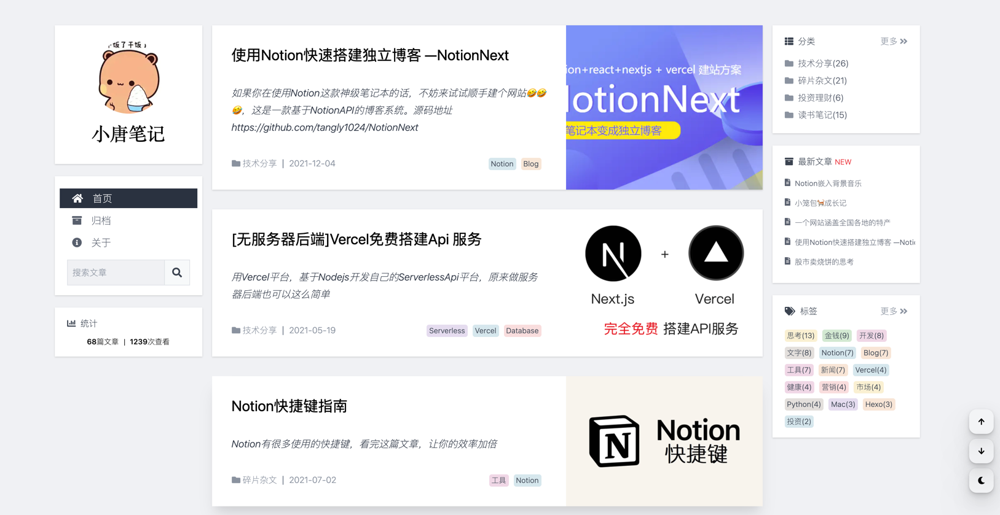

import Bleed from 'nextra-theme-docs/bleed'

# NotionNext

**NotionNext** 是一个基于 [Next.js](https://nextjs.org) 的Notion博客生成器.

他支持您Notion笔记本的页面中编写文章, 由NotionNext生成静态的文章页面、托管在Vercel的云服务中。与传统Hexo的博客类似，不需要你单独登录一个后台编辑系统，进行编辑、发布的步骤。一切都在你的笔记本中完成，随时随地写博客、记录你的工作创意与生活感悟。

不同于Hexo等静态托管博客的是，由于NextJs的强大支持，您不需要每次写好文章都重新部署Github项目，NotionNext会自动实时同步您的文章。

只需几分钟，您将获得如下的博客：

<Bleed></Bleed>
